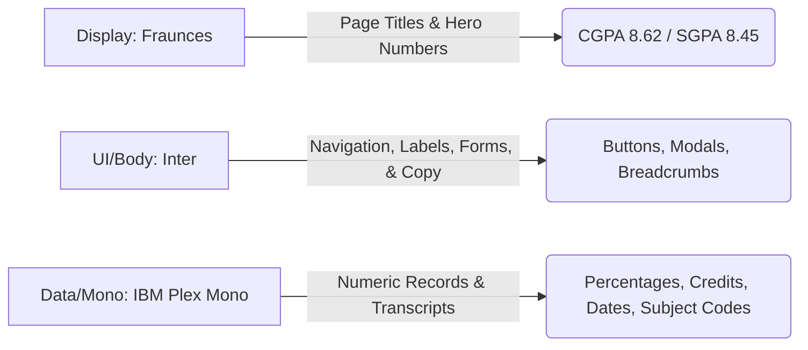
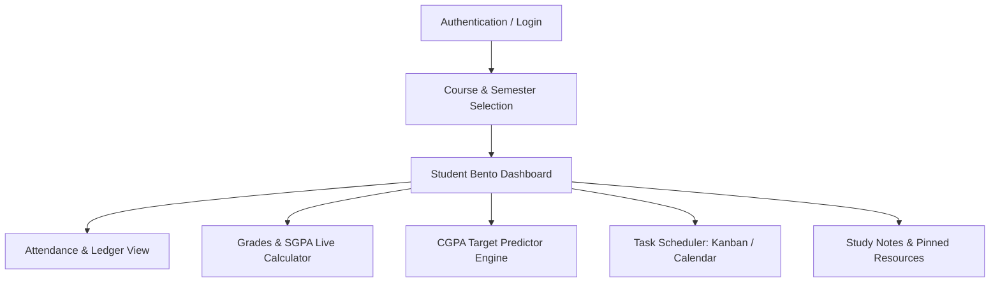
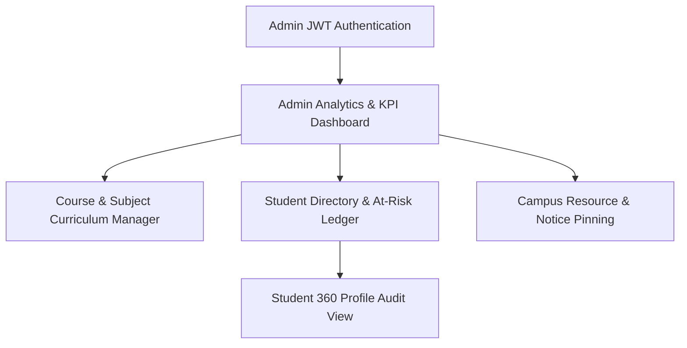

# 🎨 AcadTracker: Comprehensive UI, UX & Design Architecture

> **Document Version:** 1.0  
> **Project:** AcadTracker (Student Academic & Attendance Management Platform)  
> **Audience:** Design, Frontend Engineers, Product Managers, & Project Interviewers  
> **Tech Stack Compatibility:** React, Tailwind CSS, shadcn/ui, Recharts, React Big Calendar, React Hook Form + Zod, lucide-react

---

## 1. Executive Summary & UX Vision

**AcadTracker** transforms academic tracking from a stressful, confusing chore into an empowering, transparent, and scannable experience. Academic metrics like attendance percentages, SGPA, and CGPA often trigger student anxiety. Our UX philosophy is built around **"Calm Transparency"** and **"Numbers as First-Class Citizens."**

Instead of generic dashboard layouts or cluttered spreadsheets, AcadTracker provides a tailored, dual-surface visual language:
- **For Students:** A supportive, progress-oriented dashboard featuring physical register-style ledger strips, real-time grade predictors, and clear risk indicators.
- **For Administrators & Faculty:** A high-density, analytical data-management surface built for rapid scannability, at-risk student identification, and structured curriculum governance.

---

## 2. Core Design Principles

| Principle | UX & Design Implementation |
| :--- | :--- |
| **1. Calm, Not Alarming** | Academic status informs rather than punishes. Critical states use bold color sparingly (in badges, outline borders, and icons) rather than full-bleed red backgrounds. |
| **2. Numbers are First-Class Citizens** | SGPA, CGPA, attendance counts, and credit hours are the core product. They receive dedicated monospaced, tabular typography (`IBM Plex Mono` & `Fraunces`) so they instantly pop out from body text. |
| **3. One Glance, One Answer** | Every card or bento cell answers a single specific question: *Am I safe on attendance? What is my projected CGPA? What is due today?* Concerns are never mixed. |
| **4. The Record is the Interface** | The visual identity borrows directly from academic artifacts—attendance gradebooks, university ledgers, and degree audit checklists—giving the application an authentic, scholarly feel. |
| **5. Role-Distinct Surfaces** | While sharing unified design tokens, the Student surface feels lighter and encouraging (`Inter` UI + generous card spacing), whereas the Admin surface is tabular, compact, and data-dense (`p-2` cells + KPI rows). |

---

## 3. Brand Identity & Design Tokens

### 3.1 Color Palette
Our color scheme deliberately avoids generic AI-template defaults (such as warm creams or neon dark modes). Instead, it adopts a cool, academic slate palette inspired by fountain pen ink, teal chalkboard accents, and crisp examination paper.

| Token Name | Hex Value | Role & Usage |
| :--- | :--- | :--- |
| `ink` *(Primary)* | `#2B3A67` | Primary action buttons, active navigation items, topbar headers, and interactive links. |
| `chalk-teal` *(Accent)* | `#2E8B8B` | Secondary call-to-actions, chart projection highlights, predictor curves, and active badges. |
| `paper` *(Light Background)* | `#F3F4F7` | Cool, clean background surface for Light Mode. Prevents eye strain during long study sessions. |
| `deep-ink` *(Dark Background)* | `#14161F` | Rich, immersive background surface for Dark Mode (`slate-900/95` card surfaces). |

### 3.2 Semantic Status Palette (Fixed & Mandatory)
Per project requirements, academic health metrics are governed by exact thresholds with high-contrast, universally recognizable status tokens:

```
🟢 SAFE (≥ 75%)        → status-safe     (#2F9E64)
🟡 WARNING (65%–74%)   → status-warning  (#E8A33D)
🔴 CRITICAL (< 65%)    → status-critical (#D64545)
ℹ️ INFO & PINNED       → status-info     (#3E6FD9)
```

### 3.3 Typography Hierarchy
We employ a three-tier typography system where each typeface serves a distinct cognitive role:



- **Display (`Fraunces` - Serif, Variable Weight):** Used at `text-4xl` to `text-6xl` for hero metrics and headlines, conferring academic dignity and weight.
- **UI & Body (`Inter` - Sans-Serif):** Crisp, highly legible interface font for all controls, labels, tooltips, and explanatory copy.
- **Data & Mono (`IBM Plex Mono` - Monospaced Tabular):** Every figure representing a recorded data point (`82%`, `Sem 3`, `CS101`, `18.5 Credits`) uses monospaced alignment so numbers align perfectly vertically in tables and ledgers.

---

## 4. Signature Visual & Interactive Elements

### 4.1 The Attendance Ledger Strip
Instead of a simple, abstract progress bar, AcadTracker introduces the **Ledger Strip**—a horizontal sequence of class session markers visualising the student's actual attendance history like a physical class register:

```
Data Structures (Sem 3)                                     82% 🟢 SAFE
■ ■ ■ ■ ▢ ■ ■ ■ ■ ■ ▢ ■ ■ ■ ■ ■ ┄ ┄ ┄ ┄ ┄
                                 └─ Upcoming scheduled class (not yet held)
■ = Attended (status-safe tint)   ▢ = Absent (status-critical outline)   ┄ = Scheduled
```

- **Cognitive Impact:** Students instantly see *when* their absences occurred and exactly how many upcoming classes remain to maintain or repair their attendance buffer.

### 4.2 Degree Progress Timeline Indicator
Displayed prominently on the Student Dashboard and inside Admin Student Profiles, this interactive timeline answers: *"How far along am I in my degree trajectory?"*

```
B.Tech Computer Science  ·  Semester 3 of 8

Sem 1     Sem 2     Sem 3 (Current)   Sem 4     Sem 5     Sem 6     Sem 7     Sem 8
  ●─────────●─────────⦿ ─ ─ ─ ─ ─ ○ ─ ─ ─ ─ ○ ─ ─ ─ ─ ○ ─ ─ ─ ─ ○ ─ ─ ─ ─ ○
 8.45      8.62      Active
```
- **Completed Semesters (`●`):** Solid `ink` circle showing exact finalized SGPA below in `IBM Plex Mono`.
- **Current Semester (`⦿`):** Features a subtle pulsing animation (`animate-ping` at 50% opacity in `ink`) denoting real-time active progress.
- **Future Semesters (`○`):** Hollow `slate-300` circles connected by dashed trajectory lines.

### 4.3 Notification & Alert Center (`🔔`)
An anchored dropdown panel (`w-96`, max-height `480px`) attached to the topbar bell icon providing actionable real-time academic alerts:
- **Attendance Alerts (`🔴`):** Triggers automatically when any course drops below the mandatory 75% threshold.
- **Task Reminders (`⏰`):** Fires 24 hours prior to assignment or examination due dates.
- **Faculty Pins & Broadcasts (`📌` / `📢`):** Instant notifications when faculty pin study resources or issue announcements.
- **Zero-Friction Clear:** Features a single-click `"Mark all read"` action that removes unread indicator badges instantly.

---

## 5. Dual-Surface User Journeys & Screen Specifications

### 5.1 Student UX Architecture: Empowerment & Scannability



#### 📌 Student Bento Dashboard
- **Layout:** Responsive 3-column Bento Grid on desktop (`lg`), collapsing gracefully into single cards on mobile (`sm`).
- **Hero Card:** Large `Fraunces text-4xl` display of overall CGPA alongside semester-on-semester trend indicator arrows.
- **Quick Attendance Summary:** Top 3 at-risk courses showing condensed 10-session ledger strips and immediate *"Log Class"* action buttons.
- **Tasks Today:** High-priority items due within 24 hours with quick check-off capabilities.

#### 📌 Grades & Live SGPA Calculator
- **Interactive Transcript Table:** Students select target or received letter grades (`O`, `A+`, `A`, `B+`, `B`, `C`, `D`, `F`) via drop-in `<select>` controls per course.
- **Real-Time Sticky Bar:** As dropdowns change, a sticky bottom bar smoothly animates (`300ms` count-up) the recalculated SGPA, automatically filtering out 0-credit audit courses per academic rules.

#### 📌 CGPA Target Predictor
- **Split-Screen Simulation:** Left panel accepts anticipated grades for ongoing and future courses plus a target CGPA goal.
- **Hero Output (`text-6xl`):** Right panel dynamically renders the single most important number: **Minimum Required SGPA in remaining semesters** to successfully reach the target degree goal, supported by Best-Case and Worst-Case trajectory lines.

---

### 5.2 Admin & Faculty UX Architecture: High-Density Governance



#### 📌 Admin Analytics Dashboard
- **Executive KPI Cards:** Compact stat cards summarizing total active enrollments, campus-wide average CGPA, total at-risk students (`<75% attendance`), and task completion velocities.
- **At-Risk Triage Table:** High-density, sortable table surfacing students who are falling below attendance or grade thresholds, allowing instant deep-dive access into student records.

#### 📌 Course & Curriculum Manager
- **Two-Pane Tree Structure:** Left sidebar displays all degree courses; clicking expands a clean semester hierarchy (`Sem 1` to `Sem 8`).
- **Subject Governance:** Right pane renders editable subject tables with credit hour assignments, zero-credit audit flags, and non-destructive `"Archive"` toggles (preserving historical student records while removing subjects from future enrollments).

#### 📌 Student 360 Profile View
- **Unified Interface:** When an administrator opens a student record from the directory, it renders inside a full-page audit interface sharing identical visual components (Ledger Strips, Degree Timeline, SGPA Charts) as the student view—ensuring complete clarity and alignment during student-faculty advising sessions.

---

## 6. Component Library & UI Specifications

### 6.1 Buttons & Interactive Controls
All buttons feature `rounded-md`, explicit focus rings (`ring-2 ring-offset-2 ring-ink`), and a disabled state at 50% opacity showing an inline spinner during async operations.

| Button Variant | Visual Styling | Assigned Action Role |
| :--- | :--- | :--- |
| **Primary** | Solid `ink` background, white crisp text | Form submissions, `"Log Attendance"`, `"Save Grades"` |
| **Secondary** | Outline `border-ink`, `ink` text | Modal cancellations, `"Edit Profile"`, secondary filters |
| **Accent** | Solid `chalk-teal` background, white text | `"Run CGPA Simulation"`, `"Export Report"`, chart actions |
| **Destructive** | Outline `status-critical`, fills solid red on hover | `"Archive Subject"`, `"Remove Student Record"` |
| **Ghost** | Transparent border, `slate-600` text (`hover:bg-slate-100`) | Table row action icons, compact filter toggles |

### 6.2 Cards & Form Layouts
- **Card Anatomy:** `rounded-lg`, subtle border (`border-slate-200 dark:border-slate-800`), and flat `shadow-sm` elevation. Structure follows: **Small-Caps Label (`slate-500`) → Hero Metric (`Fraunces text-4xl`) → Supporting Context → Action Link.**
- **Forms (`React Hook Form + Zod`):** Labels positioned strictly above inputs (`text-sm font-medium slate-700`). Validation errors render directly below the target field in `status-critical` (`#D64545`) with an inline warning icon rather than a disconnected summary box.

### 6.3 Task Scheduler (Triple-View System)
Students can switch seamlessly between three persisted views (`Zustand` store maintained across route changes):
1. **List View:** Clean, scannable checklist ordered by urgency and due date.
2. **Calendar View (`React Big Calendar`):** Custom-styled calendar grid where today's column is highlighted in 10% `paper/chalk-teal`. Tasks render as pill chips color-coded by priority (`High = status-critical`, `Medium = status-warning`, `Low = slate-400`).
3. **Kanban Board:** Three structured drag-and-drop columns (`To Do`, `In Progress`, `Done`). Cards feature a tactile six-dot drag handle on top and clear course tags.

---

## 7. Responsive & Mobile Architecture

AcadTracker is engineered for flawless mobile usability (`sm` < 640px viewport), recognizing that students frequently check attendance right outside lecture halls on their smartphones.

### 7.1 Mobile Bottom Navigation Bar (`h-16`)
When the desktop sidebar (`lg`) collapses on mobile screens, navigation transitions to a fixed, thumb-friendly bottom bar displaying the 5 primary destinations:

```
┌─────────────────────────────────────────────────────────────┐
│                       (Page Content)                        │
├─────────────────────────────────────────────────────────────┤
│   🏠          📅          📊          ✅          📚        │
│  Home       Attend      Grades       Tasks     Resources    │
│  [⦿]                                                        │
└─────────────────────────────────────────────────────────────┘
```
- **Active State Indicator:** Filled icon variant (`ink` in light mode, `chalk-teal` in dark mode) paired with a bold `text-xs` label and a centered `w-1.5 h-1.5 rounded-full` active indicator dot right beneath the icon.
- **Safe Area Compliance:** Built with `pb-safe` padding to ensure zero collision with iOS home indicator bars. All scrollable page views append `pb-20` (80px bottom padding) so table rows and action buttons are never obscured behind the bottom navigation rail.

---

## 8. Accessibility, Dark Mode & Motion Design

### 8.1 Accessibility Standards (WCAG 2.1 AA Compliant)
- **Dual-Signal Coding:** Color is *never* used as the sole carrier of information. Every status indicator combines color with an icon and clear text (e.g., `🟢 Safe (82%)` vs `🔴 Critical (58%)`).
- **Contrast Ratios:** Minimum 4.5:1 text-to-background contrast verified rigorously across both `paper` and `deep-ink` backgrounds.
- **Keyboard Navigation:** Full focus-trap support inside modals (`ESC` to dismiss), keyboard-operable Kanban card reordering (`Arrow Keys`), and clear visible focus outlines on every interactive input.

### 8.2 First-Class Dark Mode Experience
Dark mode is treated as a core design environment—essential for late-night exam preparation and coding:
- **Surface Shifts:** Light `paper` (`#F3F4F7`) transitions to deep charcoal `deep-ink` (`#14161F`). Card containers use `slate-900/90` with clean `border-slate-800` outlines.
- **Accent Adaptation:** Because `ink` (#2B3A67) is too dark on charcoal surfaces, `chalk-teal` (`#2E8B8B`) elevates to become the primary interactive accent in Dark Mode.
- **Subtle Status Backgrounds:** Status pill badges adjust their background containers from white to a 15% opacity tint of their status hex (`status-safe/15`, `status-critical/15`) to prevent jarring glare while keeping icons vivid.

### 8.3 Skeleton Loading & Error States
To eliminate layout shifts (`CLS`) during data fetching, every screen implements precision-mapped skeleton shimmers:
- **Shimmer Anatomy:** Uses `bg-slate-200 dark:bg-slate-700 animate-pulse` blocks mirroring exact card and table cell heights.
- **8-Second Timeout Safety:** If network calls stall beyond 8 seconds, skeletons gracefully transition to an inline, non-disruptive Error Card (`bg-status-warning/10 border-status-warning`) offering a 1-click `"Try Again"` retry button.
- **Reduced Motion:** All count-up numbers (`300ms`), modal scales (`150ms`), and pulse animations respect system `prefers-reduced-motion` settings, instantly defaulting to static state transitions.

---

## 9. Design QA Checklist for Future Features

Whenever adding new UI components or screens to AcadTracker, developers and designers must verify against this standard check:

```
[ ] Uses strictly defined tokens (ink, chalk-teal, paper, deep-ink, status-*) without ad-hoc hex codes.
[ ] Numeric data strictly uses IBM Plex Mono; headlines use Fraunces; body copy uses Inter.
[ ] Verified across both Light Mode and Dark Mode for contrast and readability.
[ ] Dual-signal status verified: Every badge has Icon + Text + Color.
[ ] Responsive across mobile (sm bottom tab bar + pb-20 padding), tablet (md rail), and desktop (lg grid).
[ ] Interactive states (hover, active, focus ring ring-2 ring-ink) present on all clickable elements.
[ ] Skeleton loading screens match exact layout dimensions and include 8-second error timeout handling.
```

---
*Generated & Maintained as part of the AcadTracker Core Architecture Documentation Suite.*
